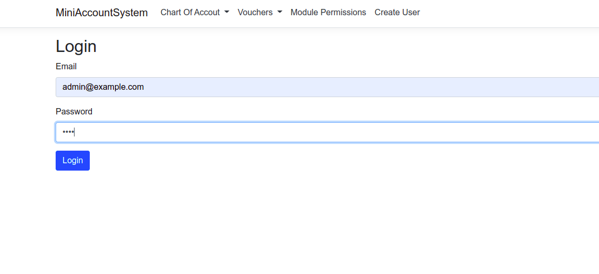
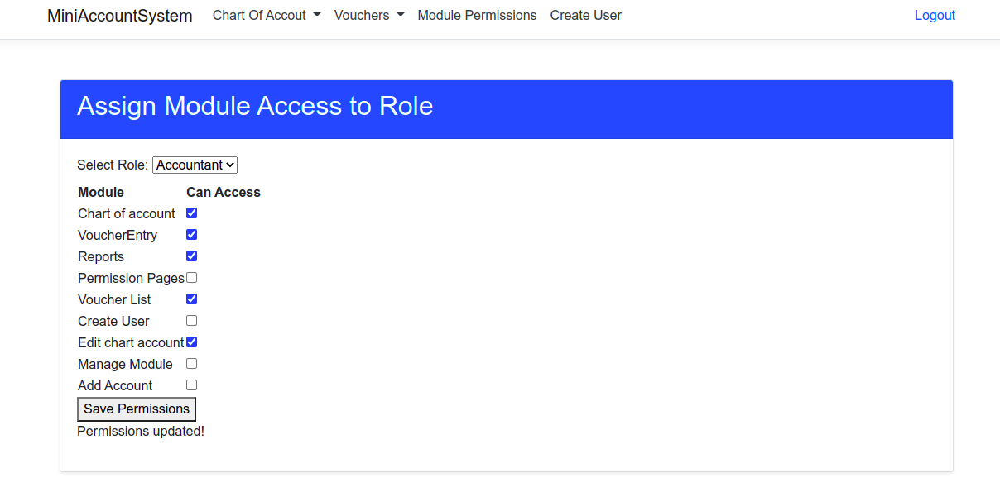
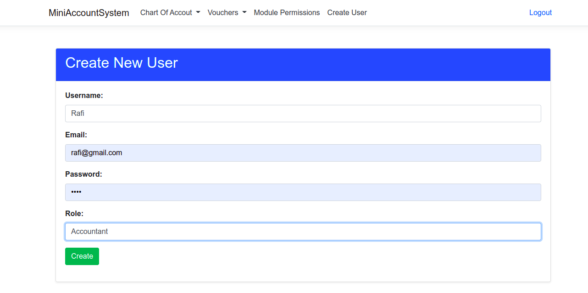
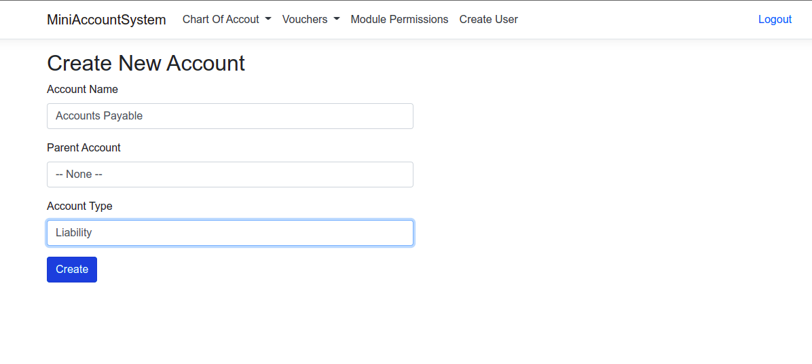
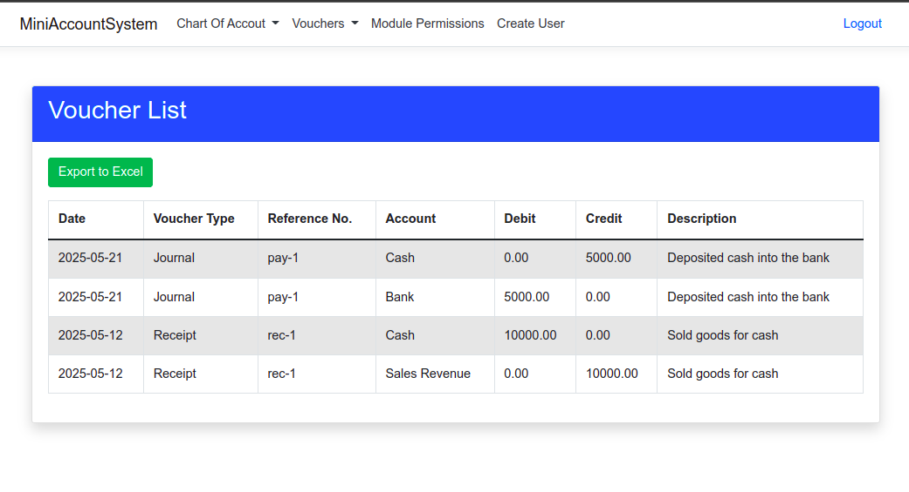
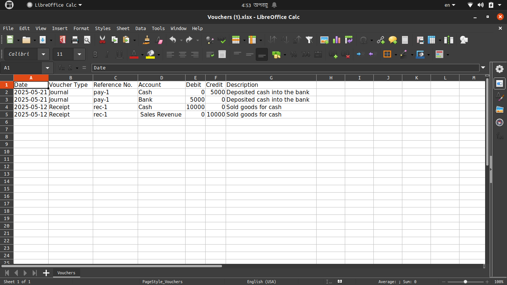
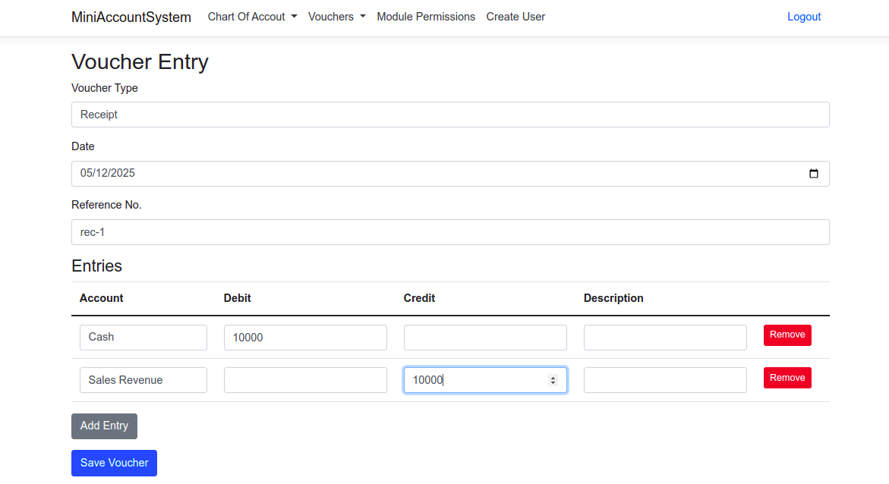

# Mini Account Management System

## Overview

The **Mini Account Management System** is a web-based application built with **ASP.NET Core Razor Pages** to manage user accounts, roles, permissions, and financial vouchers. It provides a lightweight, role-based access control system for small-scale accounting tasks, with features like user authentication, module management, voucher entry, and Excel export. The system uses **MS SQL Server** for data storage and **Bootstrap** for a responsive, user-friendly interface.


## Features

- **User Authentication**:
  - Login with email and password .
  - Logout functionality.
  - Create new users with role assignment.
- **Role-Based Permissions**:
  - Assign module access to roles (e.g., Admin, Accountant, Viewer).
  - Check permissions using a stored procedure (`CheckUserModulePermission`).
- **Module Management**:
  - Add new modules (pages) to the system.
  - Edit or delete existing modules.
- **Voucher Management**:
  - Enter financial vouchers (e.g., payments, receipts).
  - View voucher list with details (date, type, account, debit, credit).
  - Export voucher list to Excel (.xlsx) using ClosedXML.
- **Responsive UI**:
  - Bootstrap-based design (mix of 4.5.2 and 5.3.3) with cards, tables, and dropdowns.
  - Navigation menu with a dropdown for voucher-related pages.
- **Database-Driven**:
  - MS SQL Server with tables for `Users`, `Roles`, `Modules`, `RolePermissions`, `Vouchers`, and `Accounts`.
  - Seed data for roles (Admin, Accountant, Viewer) and modules (e.g., VoucherEntry, Voucher List).

## Technologies

- **Backend**: ASP.NET Core Razor Pages (.NET 8 or later)
- **Database**: MS SQL Server, accessed via Microsoft.Data.SqlClient
- **Frontend**: Bootstrap (4.5.2 and 5.3.3), jQuery, jQuery Validation
- **Excel Export**: ClosedXML
- **Development Environment**: Ubuntu, Azure Data Studio
- **Authentication**: Cookie-based (custom, no ASP.NET Identity)
- **Other**: Dependency Injection, Stored Procedures

## Prerequisites

- **.NET SDK**: Version 8.0 or later
- **MS SQL Server**: Local or remote instance
- **Azure Data Studio**: For database management
- **Git**: For cloning the repository

## Setup Instructions

### 1. Clone the Repository

```bash
git clone https://github.com/Irteja/Mini-Account-Management-System.git
```

### 2. Install Dependencies

Restore NuGet packages:

```bash
dotnet restore
```

### 3. Configure Database

1. **Create Database**: In Azure Data Studio, connect to your SQL Server and run:

   ```sql
    CREATE DATABASE MiniAccountDB;
   ```

2. **Create Tables**: Run the following schema script:

   ```sql
   USE MiniAccountSystem;
    CREATE TABLE Roles (
        RoleId INT PRIMARY KEY IDENTITY,
        RoleName NVARCHAR(50) UNIQUE NOT NULL
    );
    
    CREATE TABLE Users (
        UserId INT PRIMARY KEY IDENTITY,
        UserName NVARCHAR(50) NOT NULL,
        Email NVARCHAR(100) NOT NULL,
        PasswordHash NVARCHAR(MAX),  
        RoleId INT FOREIGN KEY REFERENCES Roles(RoleId)
    );
    
    CREATE TABLE Modules (
        ModuleId INT PRIMARY KEY IDENTITY,
        ModuleName NVARCHAR(100) NOT NULL  
    );
    
    CREATE TABLE RolePermissions (
        RoleId INT FOREIGN KEY REFERENCES Roles(RoleId),
        ModuleId INT FOREIGN KEY REFERENCES Modules(ModuleId),
        CanAccess BIT DEFAULT 0,
        PRIMARY KEY (RoleId, ModuleId)
    );
    
    
    CREATE TABLE Accounts (AccountId INT PRIMARY KEY IDENTITY,AccountName NVARCHAR(100) NOT NULL,ParentAccountId INT NULL,AccountType NVARCHAR(50), FOREIGN KEY (ParentAccountId) REFERENCES Accounts(AccountId));
    
    CREATE TABLE Vouchers
    (
        VoucherId INT IDENTITY(1,1) PRIMARY KEY,
        VoucherType NVARCHAR(20) NOT NULL, 
        Date DATE NOT NULL,
        ReferenceNo NVARCHAR(50) NOT NULL,
        AccountId INT NOT NULL,
        Debit DECIMAL(18,2) NOT NULL DEFAULT 0,
        Credit DECIMAL(18,2) NOT NULL DEFAULT 0,
        Description NVARCHAR(200),
        CreatedOn DATETIME NOT NULL DEFAULT GETDATE(),
        FOREIGN KEY (AccountId) REFERENCES Accounts(AccountId)
    );
   ```

3. **Seed Data**: Populate initial data:

   ```sql
   INSERT INTO Modules (ModuleName)
    VALUES 
        ('Chart of account'),
        ('VoucherEntry'),
        ('Reports'),
        ('Permission Pages'),
        ('Voucher List'),
        ('Create User'),
        ('Edit chart account'),
        ('Manage Module'),
        ('Add Account')
        ;
    
    
    INSERT INTO Roles (RoleName)
    VALUES 
        ('Admin'),
        ('Accountant'),
        ('Viewer');
    
    INSERT INTO RolePermissions (RoleId, ModuleId, CanAccess)
    SELECT r.RoleId, m.ModuleId, 
        CASE WHEN r.RoleName = 'Admin' THEN 1 ELSE 0 END AS CanAccess
    FROM Roles r
    CROSS JOIN Modules m;
    
    INSERT INTO Users (UserName, Email, PasswordHash, RoleId)
    VALUES ('AdminUser', 'admin@example.com', 'MTIzNA==', 1);
   ```

4. **Stored Procedure**: Create the permission check procedure:

   ```sql
    CREATE PROCEDURE InsertUser
        @UserName NVARCHAR(100),
        @Email NVARCHAR(100),
        @PasswordHash NVARCHAR(256),
        @RoleId INT
    AS
    BEGIN
        INSERT INTO Users (UserName, Email, PasswordHash, RoleId)
        VALUES (@UserName, @Email, @PasswordHash, @RoleId)
    END
    GO
    
    -- Stored procedure for getting all roles
    CREATE PROCEDURE GetAllRoles
    AS
    BEGIN
        SELECT RoleId, RoleName FROM Roles
    END
    GO
    
    
    
    -- Define TVP (Table-Valued Parameter type)
    CREATE TYPE TVP_Permissions AS TABLE (
        ModuleId INT,
        CanAccess BIT
    );
    GO
    
    CREATE PROCEDURE sp_AssignRolePermissions
        @RoleId INT,
        @Permissions TVP_Permissions READONLY  -- Table-Valued Parameter
    AS
    BEGIN
        DELETE FROM RolePermissions WHERE RoleId = @RoleId;
    
        INSERT INTO RolePermissions (RoleId, ModuleId, CanAccess) SELECT @RoleId, ModuleId, CanAccess FROM @Permissions;
    END;
    GO
    
    CREATE PROCEDURE sp_ManageChartOfAccounts
        @Action NVARCHAR(10),@AccountId INT = NULL,@AccountName NVARCHAR(100) = NULL,@ParentAccountId INT = NULL,@AccountType NVARCHAR(50) = NULL
    AS BEGIN SET NOCOUNT ON;
    IF @Action = 'Create' BEGIN INSERT INTO Accounts (AccountName, ParentAccountId, AccountType) VALUES (@AccountName, @ParentAccountId, @AccountType); END
    ELSE IF @Action = 'Update' BEGIN UPDATE Accounts SET AccountName = @AccountName, ParentAccountId = @ParentAccountId,AccountType = @AccountType WHERE AccountId = @AccountId;END
    ELSE IF @Action = 'Delete' BEGIN DELETE FROM Accounts WHERE AccountId = @AccountId; END
    ELSE IF @Action = 'Select' BEGIN SELECT AccountId, AccountName, ParentAccountId, AccountType FROM Accounts;END
    END
    GO
    
    CREATE TYPE VoucherEntryType AS TABLE
    (
        AccountId INT,
        Debit DECIMAL(18,2),
        Credit DECIMAL(18,2),
        Description NVARCHAR(200)
    );
    GO
    
    CREATE PROCEDURE sp_SaveVoucher
        @VoucherType NVARCHAR(20),
        @Date DATE,
        @ReferenceNo NVARCHAR(50),
        @Entries VoucherEntryType READONLY,
        @Result NVARCHAR(200) OUTPUT
    AS
    BEGIN
        SET NOCOUNT ON;
        BEGIN TRY
            -- Validate inputs
            IF @VoucherType NOT IN ('Journal', 'Payment', 'Receipt')
                THROW 50001, 'Invalid voucher type.', 1;
            IF @Date IS NULL OR @ReferenceNo IS NULL
                THROW 50002, 'Date and ReferenceNo are required.', 1;
    
            -- Check if ReferenceNo is unique
            IF EXISTS (SELECT 1 FROM Vouchers WHERE ReferenceNo = @ReferenceNo)
                THROW 50003, 'Reference number already exists.', 1;
    
            -- Validate entries: at least two entries, debits = credits
            DECLARE @TotalDebit DECIMAL(18,2) = (SELECT SUM(Debit) FROM @Entries);
            DECLARE @TotalCredit DECIMAL(18,2) = (SELECT SUM(Credit) FROM @Entries);
            IF @TotalDebit IS NULL OR @TotalCredit IS NULL OR @TotalDebit = 0
                THROW 50004, 'At least two entries with non-zero debit and credit required.', 1;
            IF @TotalDebit != @TotalCredit
                THROW 50005, 'Debits must equal credits.', 1;
    
            -- Insert entries
            INSERT INTO Vouchers (VoucherType, Date, ReferenceNo, AccountId, Debit, Credit, Description)
            SELECT @VoucherType, @Date, @ReferenceNo, AccountId, Debit, Credit, Description
            FROM @Entries;
    
            SET @Result = 'Voucher saved successfully.';
        END TRY
        BEGIN CATCH
            SET @Result = ERROR_MESSAGE();
            THROW;
        END CATCH
    END
    GO
    
    
    CREATE PROCEDURE CheckUserModulePermission
        @Email NVARCHAR(100),
        @ModuleName NVARCHAR(100),
        @HasPermission BIT OUTPUT
    AS
    BEGIN
        SET NOCOUNT ON;
    
        SET @HasPermission = 0;
    
        SELECT @HasPermission = CASE 
            WHEN rp.CanAccess = 1 THEN 1 
            ELSE 0 
        END
        FROM Users u
        INNER JOIN Roles r ON u.RoleId = r.RoleId
        INNER JOIN RolePermissions rp ON r.RoleId = rp.RoleId
        INNER JOIN Modules m ON rp.ModuleId = m.ModuleId
        WHERE u.Email = @Email 
        AND m.ModuleName = @ModuleName;
    
        IF @HasPermission IS NULL
            SET @HasPermission = 0;
    END;
    GO
   ```

### 4. Configure Connection String

Update `appsettings.json`:

```json
{
  "ConnectionStrings": {
    "DefaultConnection": "Server=your_server;Database=MiniAccountSystem;User Id=your_username;Password=your_password;TrustServerCertificate=True;"
  }
}
```

### 5. Run the Application

```bash
dotnet run
```

## File Structure

```
├── appsettings.Development.json
├── MiniAccountSystem.csproj
├── Pages
│   ├── ChartOfAccounts
│   │   ├── _AccountTreePartial.cshtml
│   │   ├── AddAccount.cshtml
│   │   ├── AddAccount.cshtml.cs
│   │   ├── EditChartOfAccounts.cshtml
│   │   ├── EditChartOfAccounts.cshtml.cs
│   │   ├── Index.cshtml
│   │   └── Index.cshtml.cs
│   ├── Error.cshtml
│   ├── Error.cshtml.cs
│   ├── Index.cshtml
│   ├── Index.cshtml.cs
│   ├── Modules
│   │   ├── AddModule.cshtml
│   │   ├── AddModule.cshtml.cs
│   │   ├── ManageModules.cshtml
│   │   └── ManageModules.cshtml.cs
│   ├── Permissions
│   │   ├── Assign.cshtml
│   │   └── Assign.cshtml.cs
│   ├── Privacy.cshtml
│   ├── Privacy.cshtml.cs
│   ├── Shared
│   │   ├── _Layout.cshtml
│   │   ├── _Layout.cshtml.css
│   │   └── _ValidationScriptsPartial.cshtml
│   ├── Users
│   │   ├── Create.cshtml
│   │   ├── Create.cshtml.cs
│   │   ├── Login.cshtml
│   │   ├── Login.cshtml.cs
│   │   ├── Logout.cshtml
│   │   └── Logout.cshtml.cs
│   ├── _ViewImports.cshtml
│   ├── _ViewStart.cshtml
│   └── Vouchers
│       ├── VoucherEntry.cshtml
│       ├── VoucherEntry.cshtml.cs
│       ├── VoucherList.cshtml
│       └── VoucherList.cshtml.cs
├── Program.cs
├── Properties
│   └── launchSettings.json
├── Services
│   └── PermissionService.cs
├── sql-scripts
│   ├── seed-data.sql
│   ├── stored-procedures.sql
│   └── tables.sql
└── wwwroot
    ├── css
    │   └── site.css
    ├── favicon.ico
    ├── js
        └── site.js
        
```

## Screenshots

Below are placeholders for screenshots. Add images to the `Screenshots` folder and update the paths if needed.

### Login Page


### Assign Module


### Add New User


### Add New Account For chart of account


### Voucher List



### Voucher Entry



